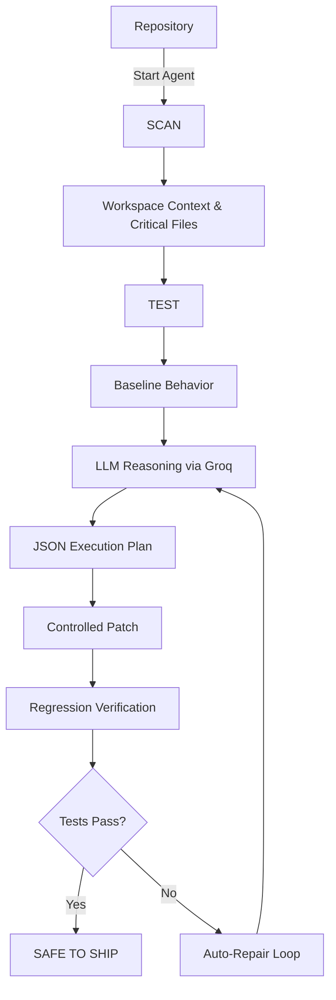

# ForgePilot
## AI Software Engineering Agent for VS Code

> Scan before you change. Verify before you ship.

ForgePilot is an autonomous AI software engineer embedded directly inside your VS Code environment. Unlike traditional coding chatbots that merely suggest code snippets, ForgePilot acts as a full-loop engineer: it autonomously inspects your repository, establishes a baseline by running your tests, reasons about software failures, safely applies patches, and automatically verifies the result against your test suite.

--------------------------------------------------
## 🚨 The Problem

Developers working on existing repositories—and AI models attempting to assist them—often face a brittle workflow:
- **Unfamiliar Codebases:** Missing the context of the broader system architecture.
- **Hidden Dependencies:** Struggling with local environments and framework configurations.
- **Failing Tests:** Being unable to confidently identify the root cause of a regression.
- **Risky AI Modifications:** LLMs notoriously return malformed patches, hallucinate code, or introduce regressions.
- **Lack of Verification:** Most AI coding tools stop after generating code, leaving the human developer to manually apply, test, and debug the AI's mistakes.

Generic AI coding assistants are powerful, but they lack a **closed-loop engineering process**. 

--------------------------------------------------
## 💡 The ForgePilot Approach

ForgePilot was built on a simple philosophy: an AI should follow the same rigorous practices as a senior software engineer.

- **SCAN:** Autonomously understand the repository architecture, language, test framework, and critical files.
- **TEST:** Establish the current behavior by natively executing the project's local test suite.
- **FIX / ENHANCE:** Reason about failures, formulate a blast radius, build a structured plan, and safely apply targeted file changes.
- **VERIFY:** Rerun regression tests to prove the fix works. If it fails, auto-repair the patch using the test output.

ForgePilot is not a "prompt-and-paste" assistant. It is an end-to-end autonomous engineering pipeline:
**Repository → Context → Analysis → Plan → Controlled Change → Verification**

--------------------------------------------------
## ✨ Why ForgePilot is Different

1. **Repository-Aware Reasoning:** It doesn't just read the active file. `RepositoryAnalyzer` recursively discovers the project's critical structure, intentionally ignoring irrelevant directories (like `node_modules` or `__pycache__`) to feed the LLM highly relevant context.
2. **Test-Before-Change Workflow:** It refuses to guess. By invoking `TestRunner`, ForgePilot establishes a concrete baseline of what is currently passing and failing before attempting any patches.
3. **Python Virtual-Environment Awareness:** Hardcoding `python3` breaks on complex projects. ForgePilot intelligently resolves local virtual environments (automatically searching `.venv/bin/python`, `venv/Scripts/python.exe`, etc.) ensuring tests run exactly as the developer intended.
4. **Structured LLM Plans & Safe Extraction:** Responses from the Groq/Qwen model are strictly enforced into a predictable JSON schema. A robust multi-stage extraction engine safely rescues JSON even if the model hallucinates markdown wrappers or conversational text, guaranteeing malformed output cannot partially corrupt repository files.
5. **Regression Verification & Auto-Repair:** Once a change is made, ForgePilot immediately reruns the test suite. If the LLM's patch breaks a previously passing test, ForgePilot captures the error trace and initiates an autonomous repair loop (up to 3 attempts) to fix its own mistake.
6. **VS Code-Native Developer Experience:** A sleek, premium, visually dense Webview UI that feels like a native VS Code panel. It provides human-readable step-by-step workflow tracking while safely collapsing technical logs.
7. **Rate-Limit Resilience:** The `LLMProvider` is hardened with exponential backoff for transient network issues and explicit token-limit safeguards (OTPM) specifically tailored for GroqCloud's fast inference endpoints.

--------------------------------------------------
## 🧠 Core Workflow



### What happens internally?
- **SCAN:** Reads the workspace root, detects Python and `pytest`, gathers all relevant `.py` files into a manifest.
- **TEST:** Resolves the local `.venv`, executes `python -m pytest`, and parses the pass/fail baseline.
- **FIX / ENHANCE:** 
  1. Combines the repository context and the user's prompt.
  2. Sends it to GroqCloud (`qwen/qwen3.8-27b`).
  3. Validates the JSON schema for `rootCause`, `blastRadius`, `plan`, and `fileChanges`.
  4. Writes the changes to disk.
- **VERIFY:** Re-invokes `TestRunner`. Evaluates the exit code. If failing, feeds the test output back to Groq for a repair patch.

--------------------------------------------------
## 🛠️ Technologies & Architecture

- **Extension Host:** TypeScript, VS Code Extension API.
- **User Interface:** Vanilla HTML/CSS/JS injected via VS Code Webview (`WebviewManager.ts`), utilizing native CSS variables for seamless theme integration.
- **Agent Orchestration:** `ForgePilotAgent.ts` manages state transitions (SCANNING → TESTING → FIXING → VERIFYING).
- **LLM Integration:** Direct REST integration with GroqCloud (`LLMProvider.ts`) for ultra-fast, low-latency reasoning using the `qwen/qwen3.8-27b` model.
- **Environment Execution:** `child_process.exec` securely isolated to the target repository's working directory (`TestRunner.ts`).

--------------------------------------------------
## 🚀 Running ForgePilot Locally

### 1. Prerequisites
- [Node.js](https://nodejs.org/) & npm installed.
- Python 3 & `pytest` installed.
- A GroqCloud API key.

### 2. Setup
```bash
git clone https://github.com/advi-cyber/ForgePilot.git
cd ForgePilot
npm install
cp .env.example .env
```
Open `.env` and configure your API key:
```env
GROQ_API_KEY=your_groq_api_key
GROQ_MODEL=qwen/qwen3.8-27b
```

### 3. Launching in VS Code
1. Open the ForgePilot repository in VS Code.
2. Press **F5** to compile and launch the "Extension Development Host".
3. In the new window, open any Python repository.
4. Press `Cmd+Shift+P` (Mac) or `Ctrl+Shift+P` (Windows) and run **`ForgePilot: Start Agent`**.

### 4. Reproducing the Automated Demo (E2E Test)
We have included a full end-to-end test that autonomously fixes a broken Python repository (`fixture/` directory) without needing the UI.
```bash
npm run compile
npm test
```
*Watch the terminal as ForgePilot scans, tests, reasons, patches, and verifies the fix.*

--------------------------------------------------
## ⚠️ Known Limitations & Future Improvements

- **Language Support:** The automated `TestRunner` and `RepositoryAnalyzer` are currently optimized for **Python / pytest**. While the LLM can reason about any language, the native verification loop relies on Python ecosystem detection.
- **Complex Multi-File Refactors:** Massive architectural rewrites that span dozens of files may hit LLM output token limits. ForgePilot currently enforces a strict 800 output token limit to respect API rate limits on fast models.
- **Planned: "Enhance" Workflow Logic:** While the UI and scaffolding exist, the `ENHANCE` feature (proposing and verifying net-new functionality) is currently experimental and heavily relies on the same fallback logic as `FIX`.
